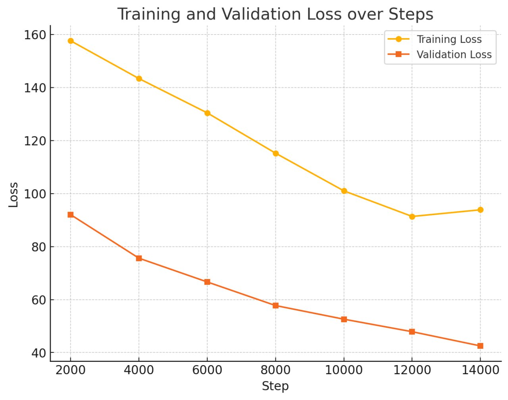
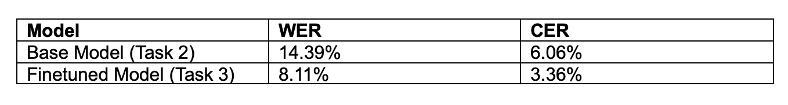

# Assessment README

### For Task 2d:
- the `cv-valid-dev.csv` file that is obtained from my API after writing the generated transcribed text is in `data/common_voice/cv-valid-dev`

### For Task 2e:
- Ensure that you have Docker installed
- In your terminal, change directory to the asr folder (where the Dockerfile is located)
- Run `docker build -t asr-api .` in the terminal
- Run `docker run -d --name asr-api -p 8001:8001 asr-api` in the terminal
- To test the asr_api end point, you may use postman to test and attach a sample MP3 under `form-data` in Body, do not use `binary` to attach a sample MP3 in Body  

### For Task 3
- Apologies for not being able to complete Task 3 locally due to the lack of GPU and some pytorch incompatibility issues with MacOS. I tried to explore Google Colab to run the training codes
1. Preprocessing was first done on the audio files by resampling them to 16kHz so as to fit the sampling rate of the audio data taken in by the model. Due to significant RAM constraints during training (limited by 12GB of RAM I had available), I filtered the training audio data to only include those that are 6s and below. This eased the RAM usage and made training possible. Finally, preprocessing was also done on the transcription by making them capitalized, to be compatible with the "Wav2Vec2CTCTokenizer.from_pretrained("facebook/wav2vec2-large-960h")" tokenizer used that contained only capital letters in its dictionary.
2. The unmodified Wav2Vec2CTCTokenizer.from_pretrained("facebook/wav2vec2-large-960h") tokenizer was used.
3. The Wav2Vec2FeatureExtractor feature extractor was used with the parameters: feature_size=1, sampling_rate=16000, padding_value=0.0, do_normalize=True. The feature size is set to 1 as the input is a single vector feature. The padding value of 0 indicates padding the audio data with silence. Normalization makes the statistics of all audio input data equal to help with training. 
4. The general workflow is as follows:
- Resample audios into a new folder in `data/resample_audio` using `asr-train/resampling.ipynb`
- Generate a new cv-valid-train_filter.csv from cv-valid-train which only contains data where audio is <= 6s.
- A AudioTextDataset class was created which takes in the cv-valid-train_filtered.csv or cv-valid-test.csv filepath and returns either train_dataset, val_dataset or test_dataset (performing train-val split) that are each an array of dictionaries storing the feature extracted audio data labeled "input_values" and tokenized transcript labeled "labels"
- A DataCollatorCTCWithPadding is also created to feed the training data into the model in batches, padding the audio and transcript data to the same length beforehand.
- The traning arguments are set as follows:
```
training_args = TrainingArguments(
    output_dir="/content/drive/MyDrive/HTX/wav2vec2-finetuned-cv",
    evaluation_strategy="steps",
    save_steps=500,
    eval_steps=2000,
    learning_rate=3e-4,
    per_device_train_batch_size=8,
    num_train_epochs=1,
    warmup_steps=500,
    #gradient_accumulation_steps = 8,
    logging_dir="./logs",
    fp16=True,  # Mixed precision for faster training on GPUs
)
```
which runs the whole traning set over 1 epoch and evaluates against the validation set every 2000 steps. THe batch size is set to a relatively low value of 8 and gradient_accumulation used so as to ease the RAM usage. fp16 is set to true to reduce the computational resource while maintaining sufficient precision.
- Finally the trainer is initialized as such:
```
trainer = Trainer(
    model=model,
    args=training_args,
    train_dataset=train_dataset,
    eval_dataset=val_dataset,
    tokenizer=processor.feature_extractor,
    data_collator=data_collator,
    callbacks=[ClearCacheCallback()]
)
```
which contains a callback that empties the cache every 500 steps to reduce RAM usage. And the model is trained.


- Overall Decrease in Loss: Both the training loss (in yellow) and validation loss (in orange) show a clear downward trend over the training steps. This indicates that the model is steadily learning to map audio waveforms to text.
- No Sudden Divergence or Plateau: Neither curve plateaus at a high value nor diverges upward, suggesting the model is not overfitting severely and is continuing to improve as training progresses.
- The curves do not appear to have fully converged. Training for additional epochs or steps might further reduce the losses.

### For Task 3c
- The overall performance metric for ASR was chosen to be the Word Error Rate (WER) where we compare the model's predictions to the target text transcripts. Another secondary metric that can be considered is the Character Error Rate (CER) where the comparison between the model's transcription to the ground truth text happens on a character-by-character basic. 
- Both WER and CER are useful metrics as the main goal of ASR is to produce accurate text from speech and they provide a clear, quantitative measure of transcription quality. Furthermore, they are language-agnostic and task-adaptable as well. 

- Interpretation of Results of Finetuned Model: 
WER at ~7.46%:
A WER below 10% is generally considered strong for many ASR tasks, indicating that the model transcribes most words accurately.
CER at ~3.14%:
The CER being lower than the WER is expected, since character‐level errors are often fewer than whole‐word errors. A CER around 3% suggests that the model handles the majority of the phoneme‐to‐character mappings correctly.

### For Task 4

**Key Observations:**
1)	Substantial Accuracy Gain:
Fine-tuning on the Common Voice data yields a noticeable reduction in word and character error rates, indicating the model adapts well to the domain of the CV-valid-dev set.
2)	Consistent Performance Gains:
CER is consistently lower than WER, indicating that most errors occur at the word level (e.g., substitutions of whole words) rather than character-level mistakes.

**Proposed Steps to Further Improve Accuracy:**
1)	An expected further improvement of model performance would come from utilizing the full training dataset if we have sufficient RAM resources. Alternatively, a lower batch count during training and higher gradient_accumulation_steps can compensate for the RAM usage with more training time.
2)	Data augmentation could be performed on the audio data, e.g. through low pass filtering, varying the tempo, or introducing artifacts like echo to artificially increase the training dataset. Alternatively, can also introduce time or frequency masking to improve robustness to real-world variations.
3)	The additional metadeta that came with the datasets: age, gender, accent could be incorporated into the model by adding additional layers on top of the base model for the extra inputs. These information can help the model make better predictions.
4)	Learning Rate Schedules & Optimizers: Experiment with different learning rates, warmup steps, or optimizers (AdamW vs. Adam) to find the best training stability and convergence.


### For Task 5b
- It seems like there is some version issue with the InstructorEmbedding package required for this task. Also tried experimenting on Google Colab, but faced similar initialisation issues as seen in the notebook in this repo

#### Due to the size of the common_voice dataset being too large to push into Git, you may have to download the common_voice dataset on your own and the common_voice folder under a data folder in the main directory

#### Repository Directory Tree:
<pre>
📁 TECHNICAL_TEST
├── 📁 asr
│   ├── asr_api.py
│   ├── cv-decode.py
│   ├── Dockerfile
│   ├── ping_api.py
│   └── requirements.txt
│
├── 📁 asr-train
│   ├── 📁 wav2vec2-large-960h-cv
│   │   ├── config.json
│   │   ├── model.safetensors
│   │   ├── preprocessor_config.json
│   │   └── training_args.bin
│   ├── cv-train-2a.ipynb
│   └── resampling.ipynb
│
├── 📁 data
│   ├── 📁 common_voice
│   │   ├── 📁 cv-invalid
│   │   ├── 📁 cv-other-dev
│   │   ├── 📁 cv-other-test
│   │   ├── 📁 cv-other-train
│   │   ├── 📁 cv-valid-dev
│   │   ├── 📁 cv-valid-test
│   │   └── 📁 cv-valid-train
│   ├── cv-invalid.csv
│   ├── cv-other-dev.csv
│   ├── cv-other-test.csv
│   ├── cv-other-train.csv
│   ├── cv-valid-dev.csv
│   ├── cv-valid-test.csv
│   ├── cv-valid-test_filtered.csv
│   ├── cv-valid-train.csv
│   ├── cv-valid-train_filtered.csv
│   ├── LICENSE.txt
│   └── README.txt
│
├── 📁 resampled_audio
│   ├── 📁 cv-valid-dev
│   ├── 📁 cv-valid-test
│   └── 📁 cv-valid-train
│
├── 📁 diagram
│   └── training_loss.jpg
│
├── 📁 hotword-detection
│   ├── cv-hotword-5a.ipynb
│   ├── cv-hotword-similarity-5b.ipynb
│   └── detected.txt
│
├── .gitignore
├── essay-ssl.pdf
├── README.md
├── requirements.txt
├── training-report.pdf
</pre>

📁 wav2vec2-large-960h-cv can be downloaded from this Google Drive link:  https://drive.google.com/drive/folders/1CTa3uJ3ruqEhK6pOijxZNoXALu3JUTJT?usp=drive_link